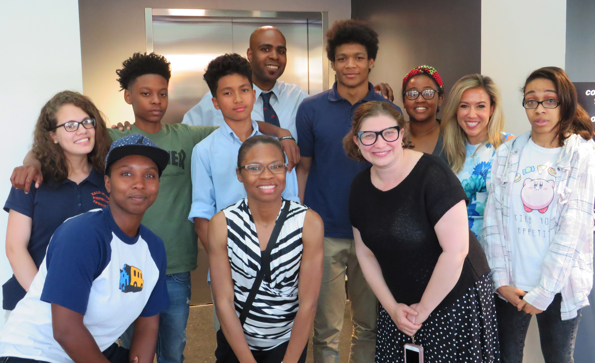
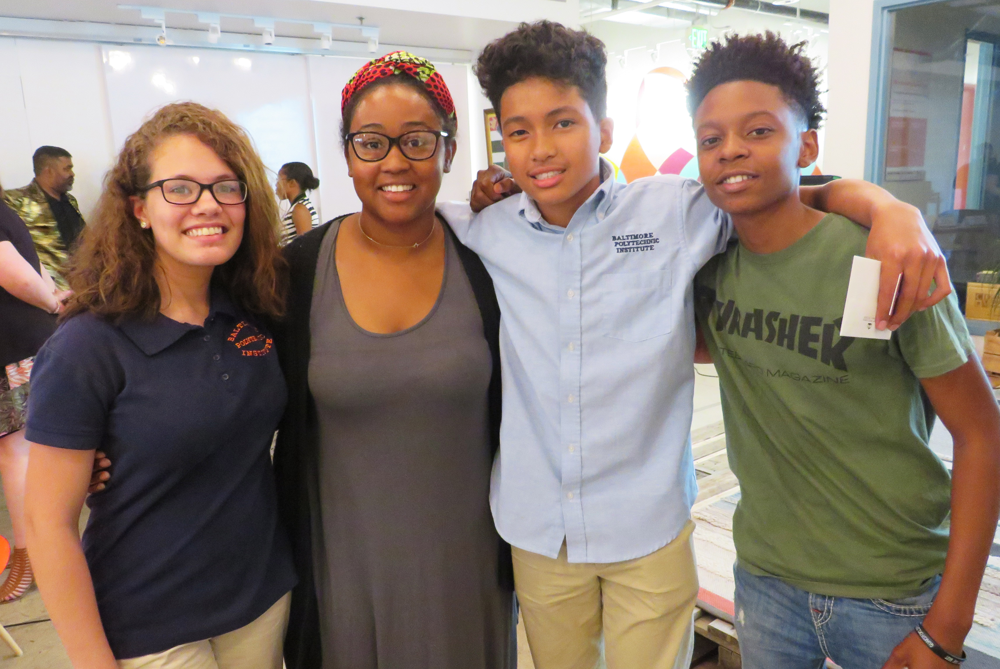
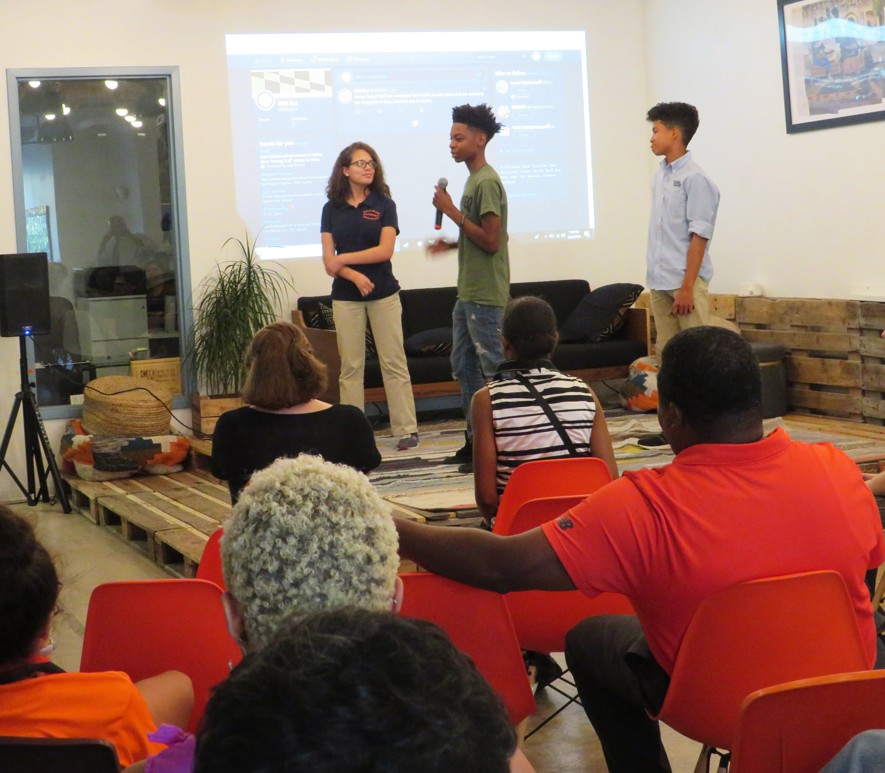
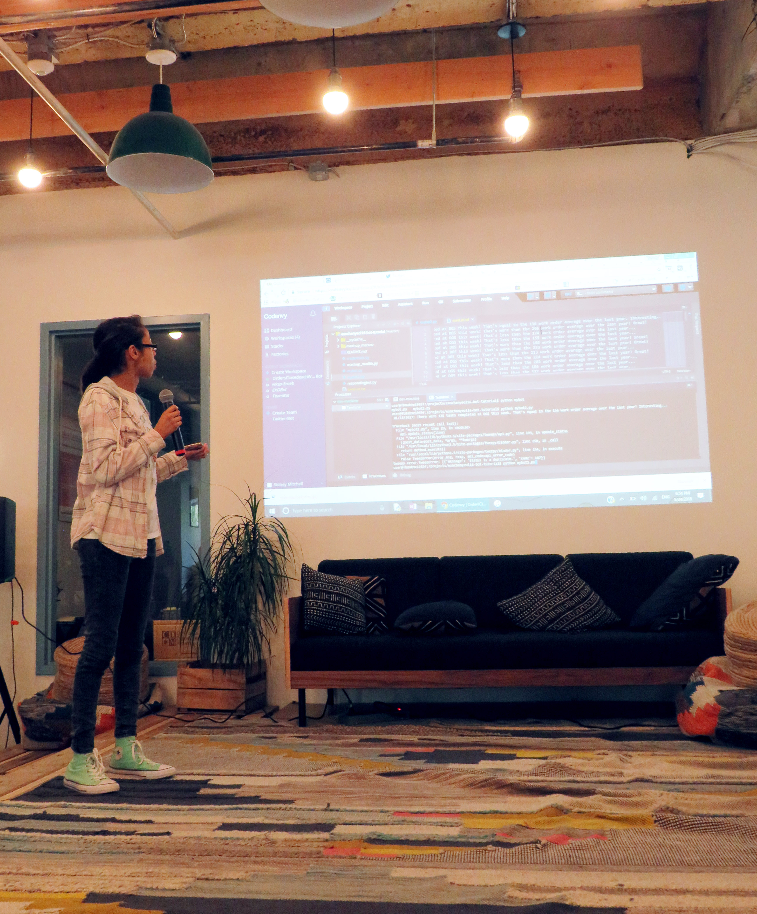
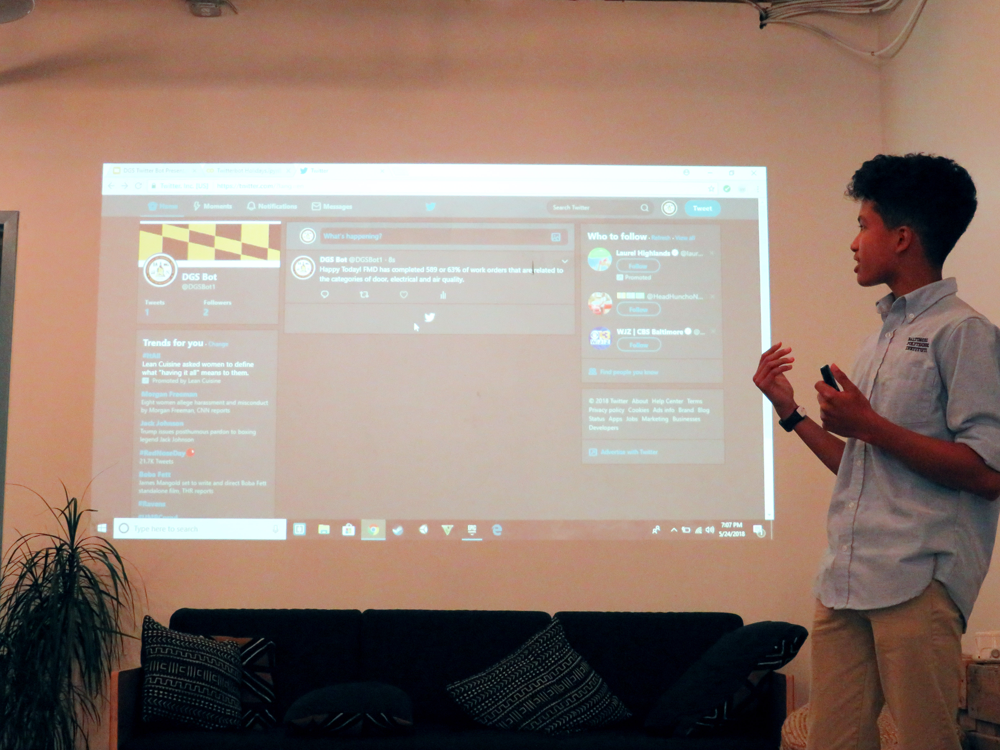

# Python Pipeline For Government Project

Pilot project and partnership between Baltimore City government (Dept. of General Services Business Process Improvement Office) and non profit partner (Code In The Schools). Project creates a project-based training and talent development pipeline to expose local high school students to Python through real agency problems and projects and develop a talent development and path into City government in computational jobs for young students.  

  
   

## Who Is This Repo For???

spell out who the repo is for...

local or state governments looking to create a similar program or talent development pipeline to attract a younger generation of students to meantingful summer internship work or expose them to opportunities for them to engage in civic hacking, small automation or data analysis projects to help improve government.

### Prerequisites

There are no prerequisites for using this repo. However, this repository may be most helpful to the public sector employee, academic or non profit partner with an interest in establishing a public-private partnership around coding & youth internships and is looking for a template or starter kit for setting up or brainstorming the program design.
```
None : )
```

### Accessing Documents

The files included here are the templates or actual program documents we used in Baltimore City for establishing, funding, negotiating and communicating both internally and externally about the Pipeline Program.  For this reason we have included them all a pdf and .docx files rather than converting them to .txt files.  

Effort was made to name files in the most expressive way to make navigating program files as quick and intuitive as possible,
```
For example, files in the Communications directory labeled:
* cits_partneship_media_advisory_jan12
* press_release_on_partnership_jan31
* press_release_on_program_feb1
* press_release_showcase_may16
```
to help provide a sense for the type and frequency of public information activity and how these actions relate to the program as a whole or individual components or milestones.


## Partners

* [Department of General Services | Business Process Improvement Office](https://generalservices.baltimorecity.gov/business-process-improvement-office) - DGS (BPIO)
* [Code In The Schools](https://www.codeintheschools.org/) - Non Profit Partner (CITS)
* [Baltimore City Office of IT](https://moit.baltimorecity.gov/) - BCIT

 John Foster, Partner & Programs Manager for Fearless Solutions
 TJ Graven, VP of Global Information Technology for [Under Armour](https://www.underarmour.com/en-us/) 
 Dr. Brian Coats, Asst VP Technology Operations & Planning for [University of Maryland Baltimore](http://www.umaryland.edu/)
 Mallory Zimmerman, Chief Operating Officer for [Linq Services](https://www.linqservices.com/)
 


## Authors

* **Babila Lima**  -- Director, Business Process Improvement Office

See also the list of [contributors](https://github.com/brl1906/PythonPipelineProgram/blob/master/Initiation_Planning/project_contributors_list.txt) who participated in this project.

## License

This project is licensed under theCC0 1.0 Universal - see the [LICENSE](https://github.com/brl1906/PythonPipelineProgram/blob/master/License.txt) file for details

## Acknowledgments

* The awesome team at [CITS](https://www.codeintheschools.org/staff/) with special shoutout to Qubilah Huddleston
* The awesome team at [DGS](https://generalservices.baltimorecity.gov/) with special shoutout to Melanie Shimano, Varghese Paranilam, Alison Lynch
